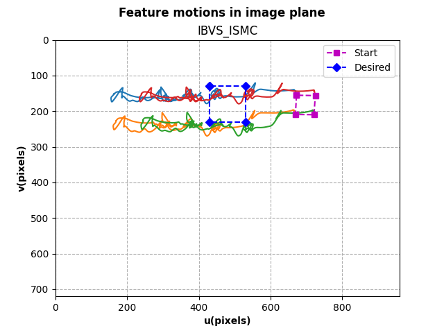

# DJI Tello Autonomous Quadcopter Position Control using IBVS

This is the repo program of my final phase in doing quadcopter position control using visual sensor that is camera which is the implementation part using a commercial available drone, a DJI Tello Ryze. This is the continuation of the simulation I've been doing before(https://github.com/WallNutss/EE234899-Quadcopter-Gazebo-VisualServoing). It is developed using framework ROS2 Foxy, with most of the main code is developed using code from [clydemcqueen](https://github.com/clydemcqueen/tello_ros). You can see the result [here](https://youtu.be/XXZDek_AamY?si=a_CI9-3EL2ZvBxWM).


## Downloading and Set up ROS Environment
Download this repo, it's basically should have everything. One should follow the guide ROS Instalation Foxy first before doing below. Check [here](https://docs.ros.org/en/foxy/Installation/Ubuntu-Install-Debians.html). For more details, you can check in `tello_ros` for more details.

```sh
$ mkdir tello_ros_ws/src
$ cd tello_ros_ws/src/
$ git clone https://github.com/WallNutss/EE234899-DJITello-VisualServoing.git .
$ cd ..
$ source /opt/ros/foxy/setup.bash
$ colcon build
```

## Connecting to DJI Tello
`tello_ros` provided the driver for us to connect it to DJI Tello, where `tello_vision` and `tello_control` are the program.

```sh
# source it first
$ source install/setup.bash
# run the driver, make sure you have connected to the drone via WiFi
$ ros2 run tello_driver tello_driver_main
# run video capturing
$ ros2 run tello_vision aruco_detector
# use ROS2 CLI to send action commands, such as takeoff or landing
$ ros2 service call /tello_action tello_msgs/TelloAction "{cmd: 'takeoff'}"
# run the IBVS, choose ibvs-pid or ibvs-ismc
$ ros2 run tello_control ibvs-pid
$ cd ..
$ source /opt/ros/foxy/setup.bash
$ colcon build
```

## What you can do (if you decided wanna run it again)
I suggested that you do not temper the code in `tello_ros` and `ros2_shared`, I have checked them and I see no problem with that. The thing you want to do is to modify the parameter I set in `tello_control`. Where in `ibvs_pid_node` and `ibvs_ismc_node` you can change the parameter at variable control_(name of the controller). I also not suggested that you tempering `tello_vision` if you do not now what are you doing, but if so you can improve or optimize the code on `tello_vision\aruco_detector_node.py`.

## System Control
<p align="center">
  
</p>

As you can see, the program was divided into three parts. One from clydemcqueen for the driver, and the other two is for the vision capture and control quadcopter. The image was taken from the ros2 message format provided by the driver and process it into the aruco_detector node. This node simply provide two purpose, process the image taken from the camera and provide estimation of the detection in case there is loss of an image on simply the image is getting blurry caused by the movement of the quadcopter. This node will publish the current location of the marker in image format(pixels) and pass them in the control program. In the `tello control` especially in each node, I have also provided the setpoint. The control is based on metode called IBVS(Image Based Visual Servoing)[1]. Although of it, the derivation of the ISMC actually (maybe) still not done yet. I have little confidence in the calculation of the controller, but it still works wonderfully, so I reference how I get to the controller using paper by Li,S[2]. Either way, another combination to solve the singularity its because IBVS actually designed at first for 6-DOF Arm Manipulator with 6 input whereas quadcopter only has 4 input, there is need to address this to. Wonderful reference of how to build IBVS actually also has been research by IVSP team[3]. Finally, where it tried to control quadcopter to reach it's destination based on the information it capture from the visual sensor (camera). In the implementation, four feature points are taken as to represent marker(with offset in v-axis about 180px and spacing 80px) in a way in image frame are. And based on those location of the feature, we want to deliver those points to desired feature location still on the image frame. The calculation is all done in one program and the end result is `\cmd_vel` to the quadcopter based on the algorithm.

## Results (Plot gallery)
Image Feature Points Trajectory side-to-side based on Controller
<p align="center">
  
  
</p>

Image Feature Trajectory each Point  side-to-side based on Controller
<p align="center">
  
  
</p>

Image Error Feature Points Trajectory side-to-side based on Controller
<p align="center">
  
  
</p>

Trajectory of the Quadcopter side-to-side based on Controller
<p align="center">
  
    
</p>

As you can see, the result for IBVS-ISMC is fantastic compared the PID. My other concern is that the overshoot that is caused by PID easlily solved by ISMC, where it can make the marker go off out of sight by camera FOV. This will headache caused we need another algorithm to solve this. Still, I'm not satisfied with the results but this will do for now.

[EDIT] as you can see, in the video I have inconsistency with the results, but I have fixed it with changing the gain to 0.05 for the IBVS gain to reduce the speed. You can see that in variable cmd at the end of the program.


## Suggestions
* There is still a lot of homework to do in form of controller design. Because in my opinion, it stil stiff(meaning is that it still heavily sensitive based on gain parameter placement)
* Add another feature. In here, I'm using only points of the marker. I've seen in other paper using lines, like horizontal vanishing point position corresponding to the intersection of the two lines passing through top and bottom tag edges. I think this will make the controller more tight in correspond to it's choice regarding it's movement
* Try another controller. I suggest try like MPC(Model Predictive Control) or RL or any other controller that doesn't have gain tuning parameter(Try you luck in adaptive control)
* Searching for DJI Tello alternative. Although DJI Tello is good for easy and fast deployment. Their API is pain in the neck for further control studies. Considering building the quadcopter from scratch or simply buy other quadcopter such as Crazyflie
* Sensor fusion implementation from camera and IMU using Kalman Filter, Particle Filter etc, for better localization

## Author
Muhammad Juniarto

Email : wallnuts73@gmail.com

## Reference
<a id="1">[1]</a> 
Corke, P (2011). 
Vision-Based Control
Robotics, Vision and Control pp 455–479

<a id="2">[2]</a> 
Li, S., Ghasemi, A., Xie, W., & Gao, Y. (2017). 
Sliding Mode Control (SMC) of Image‐Based Visual Servoing for a 6DOF Manipulator
In Recent Developments in Sliding Mode Control Theory and Applications. InTech

<a id="3">[3]</a> 
ViSp Team (2019).
Tutorial: Visual-servoing with Parrot Bebop 2 drone
https://visp-doc.inria.fr/doxygen/visp-daily/tutorial-bebop2-vs.html . I humbly thank you for this to been found. It makes my life easier.